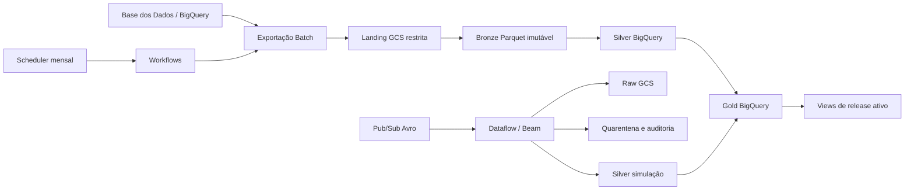

# Pipeline de alfabetização — FIAP Fase 2

Este repositório implementa um pipeline híbrido para acompanhar a alfabetização
na rede pública brasileira. O objetivo não é publicar uma nota isolada: é manter
um indicador municipal rastreável, comparar o resultado às metas oficiais e
mostrar quando uma simulação é mais recente que o último lote promovido.

O trabalho usa o **Indicador Criança Alfabetizada**, cuja referência nacional é
**743 pontos**, e trata a meta de alfabetização até 2030 como uma série que
precisa ser comparada ao ano de resultado correto. Os PDFs do desafio foram
usados apenas como fonte de requisitos, nunca como scripts ou instruções de
execução.

## Fontes oficiais

As seis fontes vêm de `basedosdados.br_inep_avaliacao_alfabetizacao`:

| Tabela | Grão de origem | Uso principal |
| --- | --- | --- |
| `uf` | ano, UF, rede | resultado consolidado por UF |
| `meta_alfabetizacao_brasil` | ano, rede | meta nacional |
| `meta_alfabetizacao_uf` | ano, UF, rede | meta estadual |
| `meta_alfabetizacao_municipio` | ano, município, rede | meta municipal |
| `municipio` | ano, município, rede | resultado municipal |
| `alunos` | ano, município, escola, aluno | detalhe restrito de estudantes |

A referência geográfica complementar é
`basedosdados.br_bd_diretorios_brasil.municipio`. Não há tabela física
`dicionario`: categorias são obtidas da própria fonte com `SELECT DISTINCT` e
registradas no manifest. O catálogo completo está em
[docs/data-catalog.md](docs/data-catalog.md).

## Arquitetura



O desenho detalhado, com identidades e fronteiras de confiança, está em
[diagrams/architecture.mmd](diagrams/architecture.mmd). As sequências Batch,
Streaming e promoção estão em [diagrams/sequences.mmd](diagrams/sequences.mmd).

### Batch

No primeiro dia de cada mês, às 03:00 em `America/Sao_Paulo`, o workflow inicia
a captura. Ele faz dry-run antes da consulta e para se o plano ultrapassar 25
GiB; esse limite só muda com autorização explícita. A exportação vai para
landing, é validada e vira Parquet Snappy imutável no Bronze com
`ifGenerationMatch=0`.

Cada partição recebe manifest com fonte, versão, contagem, fingerprint,
hashes de consulta e schema, URI/geração/CRC32C do objeto, tamanho, tempos,
SHA Git e digest da imagem. A execução só é pulada quando fingerprint, consulta
e schema coincidem. Correções de anos antigos criam outro snapshot; Bronze nunca
é sobrescrito.

### Streaming simulado

O tópico Pub/Sub recebe eventos Avro `MunicipalLiteracyRateUpdatedV1`. Dataflow
valida e separa staging válido de quarentena; depois do drain, os modelos dbt
escolhem uma linha por `event_id`, registram a cópia descartada na auditoria e
atualizam o overlay. A Gold `indicador_atual_hibrido` mostra a simulação somente
se `event_time` for posterior a `promoted_at`; ela nunca substitui histórico
oficial do Batch.

Na demonstração são aceitas 10 mensagens: oito IDs válidos distintos, uma
repetição e um evento semanticamente inválido. Uma 11ª incompatível deve ser
recusada pelo schema antes da publicação. O teste em cloud confere raw, Silver,
auditoria, quarentena, backlogs, DLQs e p95 abaixo de 60 segundos.

## Resultado e promoção

As tabelas Gold são `indicador_municipio` no grão `(ano, id_municipio, rede)`,
`comparativo_meta_resultado` no grão
`(ano_resultado, nivel_geografico, id_geografia, rede)`,
`evolucao_alfabetizacao` com `LAG` e `indicador_atual_hibrido`.

Metas de 2024 a 2030 são desnormalizadas com `UNPIVOT`. Para cada ano-meta é
escolhida a maior referência disponível menor ou igual ao ano. O gap é
`taxa_resultado - meta` em pontos percentuais. A promoção altera somente o
ponteiro singleton `ops.active_release` em transação BigQuery; em falha, o
release anterior segue ativo.

## Qualidade, privacidade e custo

Regras bloqueantes exigem chaves sem nulos, unicidade pós-quarentena,
relacionamentos completos, campos Gold centrais preenchidos, taxas entre 0 e
100 e proporções somando de 99,5 a 100,5. Repetição de taxa acima de 0,50,
volume zero ou queda acima de 50% bloqueiam a promoção. Variação acima de 20%
e aumento de nulos opcionais acima de cinco pontos percentuais geram alerta.
Freshness máxima é 35 dias.

`id_aluno` é pseudônimo, não dado anônimo. Só pode aparecer em landing, Bronze,
quarentena e Silver restritos; nunca em Gold, logs ou evidências. Landing dura
sete dias, raw/quarentena 30, Silver de alunos 365 e Bronze de alunos 730 dias.
Veja [docs/privacy-threat-model.md](docs/privacy-threat-model.md).

Monitoring e budget fazem parte da solução, mesmo com a ambiguidade do enunciado
sobre monitoramento. Budget alerta, não interrompe recursos; os freios reais são
bytes faturados, workers, timeouts, drain e zero instâncias mínimas. Premissas
de custo estão em [docs/finops.md](docs/finops.md).

## Estrutura

```text
src/                       CLI e serviços Python
schemas/                   contrato Avro do evento
dbt/                       modelos Bronze/Silver/Gold, testes e macros
infra/bootstrap/           APIs, estado, artefatos, registry e WIF
infra/stack/               dados, IAM, jobs, Pub/Sub, Dataflow e monitoramento
workflows/                 orquestração mensal e demo streaming
docs/                      decisões, operação, catálogo e entrega
diagrams/                  Mermaid versionado
tests/                     contratos, unidade, integração local e E2E local
```

## Começar localmente

Pré-requisitos: Python 3.13 e [uv](https://docs.astral.sh/uv/). Terraform,
TFLint, Trivy e Mermaid CLI são opcionais nos checks locais; se instalados,
execute também seus gates.

```bash
uv sync --all-groups
uv run alfabetizacao --help
uv run alfabetizacao config check
uv run ruff check .
uv run ruff format --check .
uv run basedpyright
uv run pytest --cov=alfabetizacao_pipeline --cov-fail-under=90
```

Os comandos de domínio ficam em [docs/runbooks.md](docs/runbooks.md). Antes de
qualquer ação na cloud, revise o plano sem aplicar:

```bash
terraform -chdir=infra/bootstrap init
terraform -chdir=infra/bootstrap plan -var-file=terraform.tfvars
```

que reúne a única lista de ações que dependem de pessoa, conta cloud ou acesso
externo.

## Provisionamento e demonstração

O provisionamento tem dois roots. `infra/bootstrap` começa com estado local,
cria o bucket de estado e migra o backend com `terraform init -migrate-state`.
`infra/stack` constrói a plataforma restante. O Scheduler fica desabilitado por
padrão e não há Dataflow permanente.

1. siga bootstrap e migração no runbook;
2. construa imagens, registre os digests e passe-os ao stack;
3. aplique bootstrap e stack apenas após revisar o plano;
4. rode Batch com `--dry-run`, promova e verifique o release ativo;
5. na demo streaming, aguarde `RUNNING`, publique a fixture, peça `DRAIN`,
   aguarde `DRAINED` e confira raw, DLQ e backlogs;
6. destrua recursos após a avaliação conforme o runbook.

Caminhos de cancelamento, retomada e rollback estão em
[docs/runbooks.md](docs/runbooks.md).

## Documentos

- [Arquitetura e sequências](docs/architecture.md)
- [Catálogo e contratos](docs/data-catalog.md)
- [Runbooks operacionais](docs/runbooks.md)
- [FinOps](docs/finops.md)
- [Privacidade e modelo de ameaça](docs/privacy-threat-model.md)
- [ADRs](docs/adr/README.md)

## Limitações conhecidas

Sem projeto GCP com billing, credenciais e autorização, este checkout não prova
IAM efetivo, custo real, `apply`, BigQuery/Dataflow ou alertas no Console. Esses
itens permanecem pendentes, não são apresentados como sucesso local. O remoto
GitHub e a entrega do vídeo também só são configurados quando a equipe fornecer
os acessos necessários.
