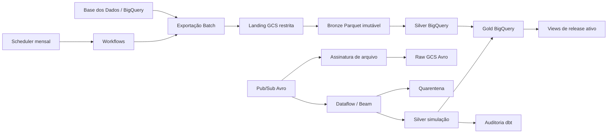

# Pipeline de alfabetização — FIAP Fase 2

Este repositório implementa um pipeline híbrido para acompanhar a alfabetização
na rede pública brasileira. O objetivo não é publicar uma nota isolada: é manter
um indicador municipal rastreável, comparar o resultado às metas oficiais e
mostrar quando uma simulação é mais recente que o último lote promovido.

O trabalho usa o **Indicador Criança Alfabetizada**, cuja referência nacional é
**743 pontos**, e compara a meta de alfabetização até 2030 ao ano de resultado
correto. Os requisitos do desafio estão consolidados nesta documentação e nos
contratos versionados do projeto.

## Como a entrega se relaciona com o enunciado

| O que o challenge pede | Onde conferir | Situação nesta entrega |
| --- | --- | --- |
| contexto educacional e seis fontes oficiais | [Fontes oficiais](#fontes-oficiais) e [catálogo de dados](docs/data-catalog.md) | implementado |
| ingestão Batch e Streaming com Bronze, Silver e Gold | [Arquitetura](#arquitetura), `src/`, `workflows/` e `dbt/models/` | implementado; execução local validada |
| tratamento, integração e camada analítica | `dbt/models/staging/`, `dbt/models/silver/` e `dbt/models/gold/` | implementado e coberto por contratos |
| duplicidade, nulos, relacionamentos e consistência | `config/quality_rules.yml`, `dbt/models/quality/` e [catálogo](docs/data-catalog.md) | implementado |
| monitoramento operacional | `infra/stack/monitoring.tf`, `ops/observability.yml` e [runbooks](docs/runbooks.md) | declarado em Terraform; prova em cloud pendente |
| FinOps e estimativa de custo | [FinOps](docs/finops.md), `ops/cost_profiles.yml` e `infra/stack/budget.tf` | implementado e validado localmente |
| solução em cloud | `infra/bootstrap/`, `infra/stack/` e [pré-requisitos](docs/cloud-prerequisites.md) | IaC concluída; `apply` depende de conta autorizada |
| ferramentas, justificativas e trade-offs | [Ferramentas e escolhas](#ferramentas-e-escolhas), [trade-offs](#trade-offs-assumidos) e [ADRs](docs/adr/README.md) | documentado |
| possível aplicação da Gold em IA | [Possibilidades futuras](#possibilidades-futuras) | documentado; não apresentado como execução atual |
| código, qualidade e documentação | `src/`, `tests/`, `.github/workflows/ci.yml` e [Documentos](#documentos) | 494 testes locais; cobertura acima de 90% |
| histórico Git, branches e PRs | branch pública `main` e commit raiz sanitizado | limitação: o histórico público não demonstra a evolução do desenvolvimento |

O vídeo executivo é entregue separadamente pela plataforma acadêmica e não faz
parte do repositório público.

## Fontes oficiais

As seis fontes vêm de `basedosdados.br_inep_avaliacao_alfabetizacao`:

| Tabela | Grão de origem | Uso principal |
| --- | --- | --- |
| `uf` | ano, UF, rede | resultado consolidado por UF |
| `meta_alfabetizacao_brasil` | ano, rede | meta nacional |
| `meta_alfabetizacao_uf` | ano, UF, rede | meta estadual |
| `meta_alfabetizacao_municipio` | ano, município, rede | meta municipal |
| `municipio` | ano, município, rede | resultado municipal |
| `alunos` | ano, município, escola, aluno | detalhe restrito de estudantes |

A referência geográfica complementar é
`basedosdados.br_bd_diretorios_brasil.municipio`. Ela é usada somente como
referência geográfica em consultas Silver, não como uma sétima fonte exportada.
O catálogo completo está em
[docs/data-catalog.md](docs/data-catalog.md).

## Arquitetura



O desenho detalhado, com identidades e fronteiras de confiança, está em
[diagrams/architecture.mmd](diagrams/architecture.mmd). As sequências Batch,
Streaming e promoção estão em [diagrams/sequences.mmd](diagrams/sequences.mmd).

### Batch

Quando habilitado, no primeiro dia de cada mês às 03:00 em
`America/Sao_Paulo`, o Scheduler inicia a captura. Ele faz dry-run antes da
consulta e para se o plano ultrapassar 25 GiB; esse limite só muda com
autorização explícita. A exportação vai para landing, é validada e vira Parquet
Snappy imutável no Bronze com `ifGenerationMatch=0`.

Cada partição recebe manifest com fonte, versão, contagem, fingerprint,
hashes de consulta e schema, URI/geração/CRC32C do objeto, tamanho, tempos,
SHA Git e digest da imagem. A execução só é pulada quando fingerprint, consulta
e schema contratado permanecem compatíveis. Correções de anos antigos criam
outro snapshot; Bronze nunca é sobrescrito.

### Streaming simulado

O tópico Pub/Sub recebe eventos Avro `MunicipalLiteracyRateUpdatedV1`. Dataflow
valida e separa staging válido de quarentena; depois do drain, os modelos dbt
escolhem uma linha por `event_id`, registram a cópia descartada na auditoria e
atualizam o overlay. A Gold `indicador_atual_hibrido` mostra a simulação somente
se `event_time` for posterior a `promoted_at`; ela nunca substitui histórico
oficial do Batch.

Na demonstração são aceitas 10 mensagens: oito IDs válidos distintos, uma
repetição e um evento semanticamente inválido. Uma 11ª incompatível deve ser
recusada pelo schema antes da publicação. O teste em cloud confere raw, Silver,
auditoria, quarentena, backlog zero das duas assinaturas principais e nenhum
encaminhamento à DLQ por `dead_letter_message_count`; ele não inspeciona o
backlog das assinaturas de auditoria da DLQ. A infraestrutura alerta para idade
de mensagem não confirmada; ela não mede p95 ponta a ponta.

Os oito eventos lógicos da fixture usam as chaves oficiais de 2024 com
`rede=publica`; por isso o Workflow de demonstração só aceita
`release_year=2024`. O Batch continua recebendo o ano de referência escolhido
para cada execução.

## Resultado e promoção

As tabelas Gold são `indicador_municipio` no grão
`(release_id, ano, id_municipio, rede)`, `comparativo_meta_resultado` no grão
`(release_id, ano_meta, nivel_geografico, id_geografia, rede)`,
`evolucao_alfabetizacao` com `LAG` e `indicador_atual_hibrido`.

O comparativo Gold integra Meta Brasil, UF e Município aos resultados. A
promoção exige ao menos uma Meta Brasil de 2030 com `rede=publica` válida entre
0 e 100; metas intermediárias, de UF e de Município podem ficar nulas quando a
fonte não as publicar, sem criar linhas ou valores inventados.

As metas disponíveis de 2024 a 2030 são convertidas ao formato longo com
`UNPIVOT`. Para cada ano-meta disponível é escolhida a maior referência
disponível menor ou igual ao ano. A meta futura disponível conduz a linha no
Gold mesmo antes da publicação do resultado. Até lá, `ano_resultado`, taxa, gap
e status ficam nulos. Se o ano já foi medido, a mesma ausência bloqueia a
promoção. O gap é
`taxa_resultado - meta` em pontos percentuais.

Na projeção pública, releases consecutivas podem carregar a mesma meta futura.
Para cada chave, prevalece a release publicada com o maior ano de referência
menor ou igual ao ano-meta. Assim, numa cadeia 2024→2025, o resultado de 2024
continua no ancestral e as metas de 2025 a 2030 vêm da versão de 2025. O
`release_id` permanece na linha para mostrar de qual versão ela veio.

A promoção usa uma transação BigQuery para reconciliar o ponteiro singleton
`ops.active_release`, os estados no registry e o `baseline_release_id` do
candidato; ela não reescreve Bronze ou Gold. Em falha, a cadeia de baseline
mantém o release correto ativo. O rollback
recebe o ano, percorre somente os ancestrais do release ativo e aponta direto para
a versão efetiva mais próxima daquele ano; repetir a mesma solicitação não muda o
estado. A correção é promovida sobre esse baseline e os anos posteriores são
reprocessados em ordem, sem atalho que mantenha diretamente o último ativo.

## Qualidade, privacidade e custo

Regras bloqueantes exigem chaves sem nulos, unicidade pós-quarentena,
relacionamentos completos, campos Gold centrais preenchidos, taxas entre 0 e
100 e proporções somando de 99,5 a 100,5. Taxa de registros duplicados acima de 0,50%,
volume zero ou queda acima de 50% bloqueiam a promoção. Variação acima de 20%
e aumento de nulos opcionais acima de cinco pontos percentuais registram aviso
e permitem a promoção; não há emissor que os transforme em alerta do Monitoring.
O volume é avaliado no fato municipal. Presença das seis fontes e relacionamentos
entre elas são verificações bloqueantes separadas.
Freshness máxima é 35 dias.

`id_aluno` é pseudônimo, não dado anônimo. Só pode aparecer em landing, Bronze,
staging, quarentena e Silver restritos; o contrato o proíbe em Gold, nas demais
saídas de consumo, em logs e em evidências.
Como não há redator automático de logs, qualquer evidência exige revisão humana.
Landing fica elegível para exclusão aos sete dias; raw e quarentena, aos 30.
O lifecycle é assíncrono e não promete remoção no instante em que a idade é
atingida. Landing, streaming e os temporários do Dataflow não usam versionamento
nem soft delete: depois que o GCS conclui o `Delete`, não resta versão recuperável
nesses buckets. Tabelas criadas no Silver restrito expiram em 365 dias. Bronze é
preservado até o teardown autorizado.
Veja [docs/privacy-threat-model.md](docs/privacy-threat-model.md).

Monitoring e budget fazem parte da solução por decisão operacional do projeto.
Sem `alert_email`, as políticas aparecem apenas no Console, sem canal de
notificação; com esse valor no tfvars local, o Terraform cria um canal de
e-mail. Uma execução FAILED de Workflow também cobre erro antes do lançamento;
o alerta `is_failed` cobre apenas Dataflow já iniciado. Budget alerta, não
interrompe recursos; os freios reais são bytes faturados, workers, timeouts,
drain e zero instâncias mínimas.
As premissas de custo estão em [docs/finops.md](docs/finops.md).

## Ferramentas e escolhas

O GCP foi escolhido porque a fonte oficial já está no BigQuery, o que reduz uma
cópia de dados antes da leitura. GCS guarda landing, Bronze e raw; BigQuery
concentra o Silver, Gold e as verificações; Cloud Run Jobs executa tarefas
finitas; Pub/Sub e Dataflow sustentam a simulação; dbt mantém transformações e
regras de qualidade versionadas. Workflows coordena os passos e Terraform deixa
identidades, limites e recursos revisáveis antes do apply.

## Trade-offs assumidos

- O Batch é a referência oficial e reproduzível; o streaming fica restrito à
  simulação para não substituir a fonte publicada.
- GCS preserva snapshots baratos e imutáveis, enquanto BigQuery entrega a
  camada de consulta e promoção. Isso adiciona uma fronteira de dados, mas
  mantém rastreabilidade e acesso analítico simples.
- Um banco NoSQL não foi incluído. As fontes são estruturadas e o uso principal
  exige joins, agregações e releases rastreáveis; BigQuery atende esse padrão de
  acesso e GCS preserva os objetos originais. Adicionar uma base de documentos
  ou chave-valor duplicaria dados sem uma consulta que justificasse a cópia.
  Pub/Sub é usado como transporte de eventos, não como banco de dados.
- Workers, timeout e 25 GiB por consulta reduzem exposição a custo. Em troca,
  uma carga maior pode exigir decisão humana antes de continuar.

## Possibilidades futuras

A camada Gold reúne resultados, metas e contexto territorial em um grão estável.
Em uma etapa futura, essa base pode alimentar modelos de IA para sinalizar risco
de defasagem ou apoiar a priorização de análises. Um uso desse tipo ainda exige
avaliação de viés, explicabilidade e revisão humana; ele não faz parte da
execução atual.

## Estrutura

```text
src/                       CLI e serviços Python
schemas/                   contrato Avro do evento
dbt/                       modelos Bronze/Silver/Gold, testes e macros
infra/bootstrap/           APIs, estado, artefatos, registry e WIF
infra/stack/               dados, IAM, jobs, Pub/Sub, Dataflow e monitoramento
workflows/                 orquestração mensal e demo streaming
docs/                      decisões, operação, catálogo e entrega
diagrams/                  Mermaid versionado
tests/                     contratos, unidade, integração local e E2E local
```

## Começar localmente

Pré-requisitos: Python 3.13 e [uv](https://docs.astral.sh/uv/). Terraform,
TFLint, Trivy e Mermaid CLI são opcionais nos checks locais; se instalados,
execute também seus gates.

```bash
uv sync --all-groups
uv run alfabetizacao --help
uv run alfabetizacao config check
uv run ruff check .
uv run ruff format --check .
uv run basedpyright
uv run pytest --cov=alfabetizacao_pipeline --cov-fail-under=90
```

Os comandos de domínio ficam em [docs/runbooks.md](docs/runbooks.md). Antes de
qualquer ação na cloud, revise o plano sem aplicar:

```bash
terraform -chdir=infra/bootstrap init
terraform -chdir=infra/bootstrap plan -var-file=terraform.tfvars
```

Antes de qualquer `apply`, confira os dados de conta, localização e acesso em
[docs/cloud-prerequisites.md](docs/cloud-prerequisites.md).

## Provisionamento e demonstração

O provisionamento tem dois roots. `infra/bootstrap` usa estado local para criar
as APIs, o bucket de state e os artefatos. Só depois do bootstrap aplicado o
build imutável pode publicar as imagens e o arquivo de schemas. Com o smoke
aprovado, o output `state_bucket` permite preencher
`infra/stack/backend.hcl`; aí o stack pode inicializar, migrar o state e ser
aplicado.

`infra/stack` constrói a plataforma restante. O Scheduler fica desabilitado por
padrão e não há Dataflow permanente.

1. siga o runbook do bootstrap e aplique esse root após a autorização;
2. construa as imagens, execute o smoke por digest e capture os cinco digests
   (`batch`, `dbt`, `producer`, `dataflow_template` launcher Flex e
   `dataflow_sdk` runtime Beam) e as seis URIs de schema;
3. crie o backend do stack, inicialize/migre o state e só então planeje e aplique
   `infra/stack`, depois de revisar os pré-requisitos de cloud;
4. rode Batch com `--dry-run`, promova e verifique o release ativo;
5. na demo streaming, aguarde `RUNNING`, publique a fixture, peça `DRAIN`,
   aguarde `DRAINED` e confira raw, backlog zero das duas assinaturas principais
   e nenhum encaminhamento à DLQ por `dead_letter_message_count`;
6. destrua recursos após a avaliação conforme o runbook.

Caminhos de cancelamento, retomada e rollback estão em
[docs/runbooks.md](docs/runbooks.md). Os dados necessários para provisionar o
ambiente estão em [docs/cloud-prerequisites.md](docs/cloud-prerequisites.md).

## Repositório

O código e a documentação técnica estão no repositório
[tech-challenge-fase2-alfabetizacao-pipeline](https://github.com/kevinbds/tech-challenge-fase2-alfabetizacao-pipeline).

## Documentos

- [Arquitetura e sequências](docs/architecture.md)
- [Catálogo e contratos](docs/data-catalog.md)
- [Runbooks operacionais](docs/runbooks.md)
- [Pré-requisitos de cloud](docs/cloud-prerequisites.md)
- [FinOps](docs/finops.md)
- [Privacidade e modelo de ameaça](docs/privacy-threat-model.md)
- [ADRs](docs/adr/README.md)

## Limitações conhecidas

Sem projeto GCP com billing, credenciais e autorização, este checkout não prova
IAM efetivo, custo real, `apply`, BigQuery/Dataflow ou alertas no Console. Esses
itens dependem de execução em uma conta cloud e não são apresentados como
sucesso local.
